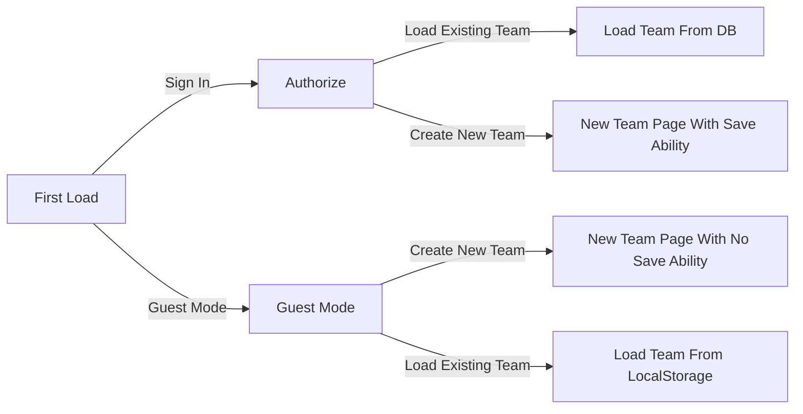

```mermaid
flowchart LR;
  A[First Load] -- Sign In --> B[Authorize]
  A[First Load] -- Guest Mode --> C[Guest Mode]
  B[Authorize] -- Load Existing Team --> D[Load Team From DB]
  B[Authorize] -- Create New Team --> E[New Team Page With Save Ability]
  C[Guest Mode] -- Create New Team --> F[New Team Page With No Save Ability]
  C[Guest Mode] -- Load Existing Team --> G[Load Team From LocalStorage]
```